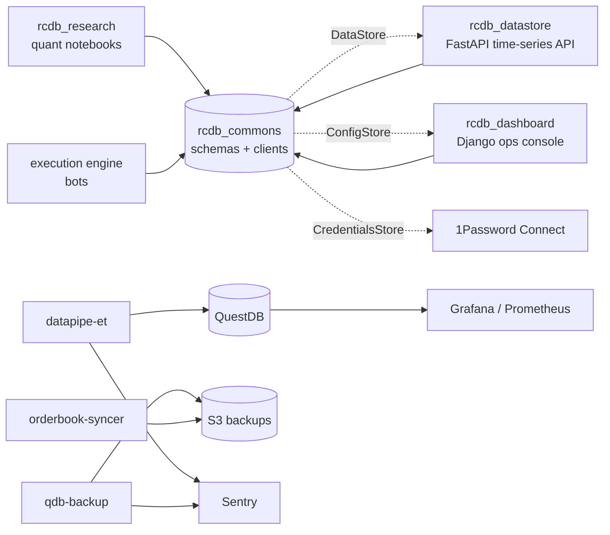

# rcdb_commons

> Shared Python SDK and schemas for the RCDB trading platform.

**Archived.** Cloned from `hcmc-project/rcdb_commons`. Part of the **RCDB** trading stack. Later folded into [3Jane](https://github.com/3jane).

---

## Table of contents

- [What this was](#what-this-was)
- [Tech stack](#tech-stack)
- [What's inside](#whats-inside)
- [Schema highlights](#schema-highlights)
- [Operational tooling](#operational-tooling)
- [Architecture role](#architecture-role)
- [Lineage](#lineage)
- [Sibling repos](#sibling-repos)

## What this was

This was the **shared SDK every RCDB service linked to**. It held the Pydantic schemas that crossed every service line. Bots, the dashboard, the datastore, and the research repo all spoke through it.

On top of the schemas it shipped **three typed REST clients**:

- `DataStore` - push and pull time-series rows
- `ConfigStore` - fetch a typed `BotConfigResponse` by `bot_id`
- `CredentialsStore` - read API keys from a self-hosted 1Password Connect vault

The repo also packs the **ops sidecars** that kept the stack live: a Python ETL into QuestDB, a partition backup to S3, an orderbook dump to S3, a YAML maker for Chronicle Queue stream configs, plus Docker stacks for Sentry, 1Password Connect, Grafana, and Prometheus.

## Tech stack

| Layer | Tools |
|---|---|
| Language | Python 3, `setuptools` |
| Schemas and validation | `pydantic==1.8.1` (discriminated unions, root validators, `Literal` config types) |
| HTTP | `requests~=2.26.0` with `requests-mock` for tests |
| Data | `pandas~=1.3.4` |
| Time-series sink | QuestDB via `questdb.ingress.Sender` (line protocol) |
| Secrets | 1Password Connect (`onepasswordconnectsdk==1.0.1`), self-hosted via Docker Compose |
| Object storage | AWS S3 (`s3fs`, `aws s3 sync`) |
| Observability | Sentry (`sentry_sdk`), Grafana OSS, Prometheus, `node_exporter` |
| Streams config | Chronicle Queue / Chronicle Services YAML |
| Test | `pytest==6.2.2`, `pytest-mock`, `requests-mock` |

## What's inside

- `data_store.py`, `config_store.py` - top-level entry points (kept for backwards compatibility); the real implementations live under `lib/stores/`
- `lib/stores/data_store.py` - typed `DataStore` REST client. Auto-detects the `DataType` (`ohlcv`, `kalman`, `bot_performance`, `price_index`, `account_trades`) from a DataFrame's columns and POSTs rows to `/log/`; `read()` returns timestamp-indexed DataFrames from `/latest/`
- `lib/stores/config_store.py` - typed `ConfigStore` REST client. `get_config(bot_id)` returns a fully parsed `BotConfigResponse`, dispatched through Pydantic's discriminated union on `config_type`
- `lib/stores/credentials_store.py` - `CredentialsStore` wraps the 1Password Connect SDK; `replace_exchange_credentials_with_secrets()` resolves an `ExchangeCredentials` whose `credentials` field is a vault item title into one whose `credentials` field is the decrypted JSON
- `lib/schemas/exchange.py` - the trading domain: `Exchange`, `AccountType`, `ExchangeCredentials`, `Symbol`, `SymbolFutures`, `Instrument`, `Order`, `OrderBook`, `Position`, `Positions`, `AssetSpotBalance` / `AssetMarginBalance` / `AssetFuturesBalance`, `OrderSide`, `OrderType`, `OrderStatus`, `TransferType`
- `lib/schemas/strategy_configs.py` - the strategy zoo: ~15 active `*Config` variants (pure market making, grid, stat-arb Kalman, spike filter, trend following, futures, cross-exchange MM, spot-to-futures hedge, ZMQ external price, orderbook collectors, ...) plus `BorrowingConfig`, `OrderGridConfig`, `BotConfigResponse`, and the `STRATEGY_CONFIG_CLASS_MAP` registry
- `lib/schemas/exchange_events.py` - `ExchangeEvents` and `BinanceStreams` event-type enums
- `lib/misc/rounding.py` - `to_precision`, `to_auto_price_precision`, `Rounder` (decimal-safe price/amount quantization down to sub-bp precision)
- `lib/misc/types.py`, `lib/misc/id_generator.py` - small typing and id helpers
- `lib/helpers/graceful_killer.py` - SIGINT/SIGTERM trap for long-running workers
- `services/` - operational sidecars (see below)
- `tests/` - `pytest` coverage for the three stores and the schema/enum layer (`test_datastore.py`, `test_credentials_store.py`, `test_schemas.py`, `test_enums.py`) using `requests-mock` and `pytest-mock`

## Schema highlights

All schemas are `pydantic.BaseModel` in `lib/schemas/`. They are shared as-is by the datastore, dashboard, research, and bots.

| Model | Notes |
|---|---|
| `ExchangeCredentials` | `{exchange, credentials, type}`. `credentials` is a dict, or a vault item title that `CredentialsStore` resolves |
| `ExchangeCredentialsEmpty` | `Literal['EMPTY']` sentinel for defaults |
| `AccountType` | `MAIN`, `SPOT`, `SWAP`, `CROSS_MARGIN`, `ISOLATED_MARGIN`, `USDT_M_FUTURES`, `COIN_M_FUTURES`, Bybit `INVERSE_*` |
| `Exchange` | Binance (spot, USDM, COINM, swap), Ascendex, Coinbase, Commex, Kraken, OKEx, KuCoin, Bybit, Huobi, WhiteBIT |
| `Symbol`, `SymbolFutures` | Pair shape with `from_ccxt` / `from_binance` parsers and `to_*` writers |
| `BotConfigResponse` | Wire shape from the config API. `strategy_config` is a `Union` keyed on `config_type` |
| Strategy configs | `GridConfig`, `PureMarketMakingConfig` (and futures, spike-filter, external-price, ZMQ, cross-price, futures-external variants), `StatArbKalmanConfig`, `CrossExchangeMarketMakingFuturesConfig`, `SpotToFuturesHedgingConfig`, `FuturesToFuturesHedgingConfig`, `TrendFollowingMakingFuturesConfig`, `OrderBookCollectorSpotConfig`, `OrderBookCollectorFuturesConfig`, `BSwapSellConfig` |
| `BorrowingConfig` | Cross-margin borrow and repay levels with a `margin_level_max` cap |
| `OrderGridConfig`, `LongOrderGridConfig`, `ShortOrderGridConfig` | Entry and exit grid params. Convert to `BidAskLevelsConfig` by side |
| `Order`, `OrderBook`, `Position`, `Positions`, `AccountBalance`, `AccountMarginBalance` | Wire types with `Decimal` math. `OrderBook.bid_ask_no_dust()` skips dust |
| `AdminConfigInput` | Dashboard admin form shape. `root_validator`s tie `config_type` to `type(data).__name__` |

## Operational tooling

- `services/datapipe-et/` - Python ETL (`main.py` + `src/data_loader.py`, `src/fsio.py`) that reads per-account spot/swap trade and kline CSVs, normalizes columns, joins quote prices and fees, and ingests into QuestDB via the `questdb.ingress.Sender` line protocol. Posts to the dashboard API using a bearer token; reports failures to Sentry when `SENTRY_DSN` is set.
- `services/qdb-backup/` - rolls QuestDB partitions older than the retention window (`orderbook`: 24 partitions, `trades`: 7 * 24, `price_tickers`: 7) out of the live database to an `s3fs`-mounted `qdb-backups` bucket as gzipped CSVs; retries with backoff on connection failure.
- `services/orderbook-syncer/dump-orderbooks.sh` - `aws s3 sync` of gzipped daily orderbook captures to an S3 bucket, excluding the file dated today; removes successfully uploaded files locally.
- `services/datapipe-streams-conf-generator/` - generator that pulls live exchange credentials from `dash.3jane.com/api/exchange-credentials`, partitions them into SPOT and USDT_M_FUTURES batches, and emits Chronicle Queue / Chronicle Services YAML configs that wire up the per-exchange data, orderbook, ticker, and trade streams plus monitoring exporters and a Prometheus gateway.
- `services/grafana/` - bootstrap `start.sh` that brings up Prometheus and Grafana OSS in Docker, with provisioned `nodes/` (`node_exporter` install script, systemd unit, Docker `daemon.json`), `prometheus.yml`, and nine pre-built dashboards under `dashboards/` (account assets, accounts data, futures accounts, Chronicle metrics, high-level overview, Node Exporter Full, QuestDB, table stat, table updates).
- `services/sentry/` - Docker Compose stack for a self-hosted Sentry instance used by the platform; the Python services hook into it via `sentry_sdk.init(SENTRY_DSN)`.
- `services/1password-connect-server/` - Docker Compose stack for the on-prem 1Password Connect server that `CredentialsStore` talks to.

## Architecture role

`rcdb_commons` sat in the middle. Every service used it for schemas and clients. It used no other RCDB code. It spoke to them only by `api_url` and `token`, both passed in.

The pattern: **URLs and tokens passed in at build time**, never direct imports. Each service ships on its own. `rcdb_commons` only fixes the wire shape.

## Lineage

- **Origin:** `hcmc-project/rcdb_commons` (private)
- **Archive:** `tartakovsky-archive/rcdb_commons` (this repo)
- **Successor:** [3Jane Technologies](https://github.com/3jane)

## Sibling repos

- [rcdb_datastore](https://github.com/tartakovsky-archive/rcdb_datastore) - FastAPI time-series API
- [rcdb_dashboard](https://github.com/tartakovsky-archive/rcdb_dashboard) - Django operations console
- [rcdb_research](https://github.com/tartakovsky-archive/rcdb_research) - quantitative research framework
